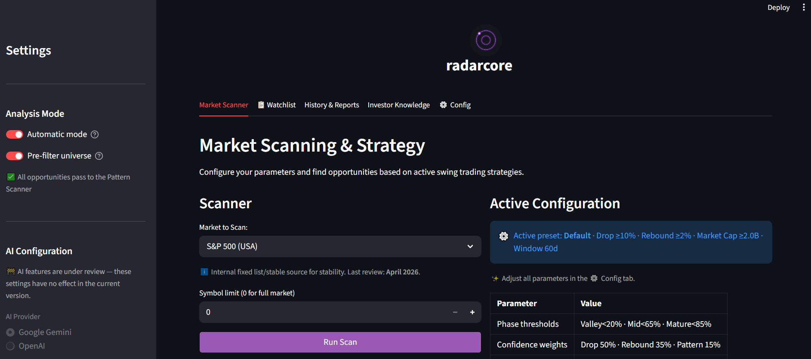

# radarcore

[](https://opensource.org/licenses/MIT)
[](https://github.com/ibelchi/radarcore)
[](https://www.python.org/)

**Stop scrolling financial news. Let the scanner do the watching.**

---


*Main scanner view — active opportunities ranked by confidence score*

---

## Features

- 📡 Scans S&P 500, NASDAQ, IBEX 35 and other global indices for swing trade setups
- Detects technical corrections (drops + rebounds) based on configurable thresholds
- Three built-in strategy presets: Conservative, Default, Aggressive
- Confidence scoring (0–100) per signal, combining RSI, drop %, and rebound %
- Watchlist with persistent history — soft deletes keep your audit trail intact
- AI-generated market context per opportunity (requires Gemini API key)
- Anti-blocking ingesta layer for yfinance: exponential backoff, 429 detection
- 🗄️ Local SQLite storage — no external database, no telemetry, runs fully offline

---

## Quick Start

> Requires Python 3.9+, Docker and Docker Compose.

**1. Clone and configure**

```bash
git clone https://github.com/ibelchi/radarcore.git
cd radarcore
cp .env.example .env
# Edit .env and add your GOOGLE_API_KEY (optional — AI context features only)
```

**2. Start with Docker Compose**

```bash
docker compose up --build
```

**3. Open the app**

```
http://localhost:8501
```

That's it. The SQLite database is created automatically on first run at `data/radarcore.db`.

> **No Docker?** Install dependencies directly:
> ```bash
> python -m venv venv && source venv/bin/activate  # Windows: venv\Scripts\activate
> pip install -r requirements.txt
> streamlit run app.py
> ```

---

## Configuration

All configuration is done via environment variables. Copy `.env.example` to `.env` and fill in what you need.

| Variable | Required | Description |
| :--- | :--- | :--- |
| `GOOGLE_API_KEY` | Optional | Enables AI-generated market context (Gemini). Without it, the scanner still works fully. |
| `OPENAI_API_KEY` | Optional | Alternative LLM provider for report generation. |
| `STREAMLIT_PORT` | Optional | Default: `8501`. Change if the port is already in use. |
| `LOG_LEVEL` | Optional | `INFO` (default) or `DEBUG` for verbose scanner logs. |

> The app reads `.env` via `python-dotenv`. Never commit your `.env` file — it is already in `.gitignore`.

---

## Tech Stack

| Layer | Technology | Version |
| :--- | :--- | :--- |
| Language | Python | 3.9+ |
| UI | Streamlit | ≥1.30.0 |
| Database | SQLite + SQLAlchemy | 2.0+ |
| Data ingestion | yfinance | 0.2.30+ |
| Processing | Pandas / NumPy | 2.0+ |
| Visualisation | Plotly | 6.0+ |
| AI / LLM | Google Gemini / OpenAI | Latest |
| AI framework | LangChain | 0.0.6+ |

---

## Roadmap

- ✅ Phase 1 — Scanner engine and strategy presets
- ✅ Phase 2 — SQLite persistence and opportunity history
- ✅ Phase 3 — Advanced charts and visualisation
- 🔄 Phase 4 — RAG engine and AI-generated reports *(in progress)*
- ⏳ Phase 5 — Historical backtesting
- ⏳ Phase 6 — Real-time alerts

---

## Contributing

Fork the repo, create a branch, open a PR. No CLA, no contributor agreement.

If you find a bug or want to propose a feature, open an issue first so we can align before you write code. The codebase is modular by design — new strategies and data sources slot in cleanly under `src/strategies/` and `src/data/`.

All contributions welcome: code, docs, bug reports.

---

## License

MIT — see [LICENSE](LICENSE).

> **Disclaimer:** radarcore is an educational tool. Nothing it produces is financial advice. Use it to learn, not to make investment decisions.
